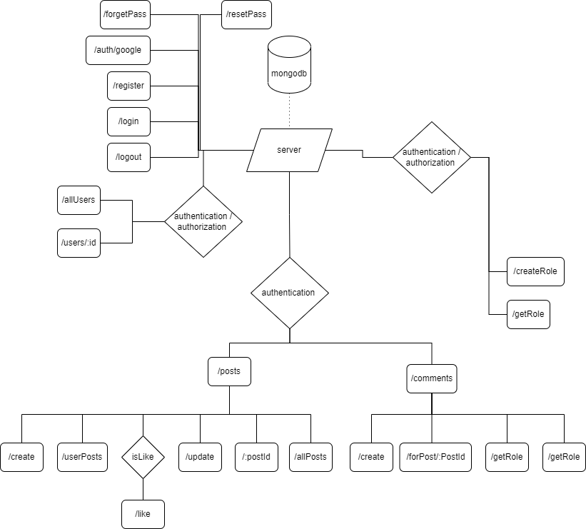
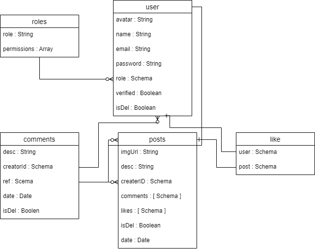

# W08D04

## social media API

this API is social media useing crud operations

## Features

create role.
get all roles in database.
create new user.
log in by eamil and password.
get all users in database.
delete a user.
create post.
get user post.
upadet post.
delete post.
get all post.
like a post.
create comment.
get comment for one post.
delete comment.

## used library

- express
- cors
- morgan
- dotenv
- mongoose
- bcrypt
- jsonwebtoken

## Models

comments model

```
{
   desc: { type: String, required: true },
  creatorId: {
    type: mongoose.Schema.Types.ObjectId,
    required: true,
    ref: "Users",
  },
  ref: { type: mongoose.Schema.Types.ObjectId, required: true, ref: "Posts" },
  date: { type: Date, default: new Date() },
  isDel: { type: Boolean, default: false },
}
```

likes model

```
 {
  user: { type: mongoose.Schema.Types.ObjectId, required: true, ref: "Users" },
  post: { type: mongoose.Schema.Types.ObjectId, required: true, ref: "Posts" },

 }
```

posts model

```
 {
  imgUrl: { type: String },
  desc: { type: String, required: true },
  createrID: {
    type: mongoose.Schema.Types.ObjectId,
    required: true,
    ref: "Users",
  },
  comments: [
    {
      type: mongoose.Schema.Types.ObjectId,
      ref: "Comments",
    },
  ],
  likes: [
    {
      type: mongoose.Schema.Types.ObjectId,
      ref: "Likes",
    },
  ],
  isDel: { type: Boolean, default: false },
  date: { type: Date, default: new Date() },
 }
```

role model

```
 {
  role: { type: String, required: true },
  permissions: { type: Array, required: true },

 }
```

todos model

```
 {
  name: { type: String, required: true },
  isDel: { type: Boolean, default: false, required: true },
  ref: { type: mongoose.Schema.Types.ObjectId, ref: "users" },

 }
```

user model

```
 {
  avatar: {
    type: String,
    default:
      "https://cdn.pixabay.com/photo/2015/10/05/22/37/blank-profile-picture-973460__340.png",
  },
  name: { type: String, required: true, unique: true },
  email: { type: String, required: true, unique: true },
  password: { type: String },
  role: {
    type: mongoose.Schema.Types.ObjectId,
    ref: "Roles",
    default: "61a735c3931d13080ac69fef",
  },
  verified: { type: Boolean, default: false },
  isDel: { type: Boolean, default: false },
 }
```

## Backend routes

| HTTP Method | URL                         | Request Body                    | Success status | Error Status | Description                                                     |
| ----------- | --------------------------- | ------------------------------- | -------------- | ------------ | --------------------------------------------------------------- | --- |
| POST        | `/createRole`               | { role, permissions }           | 201            | 400          | create new role                                                 |
| GET         | `/getRole`                  | { name, email, password, role } | 200            | 400          | show all role in the database                                   |
| POST        | `/register`                 | {username, password}            | 201            | 401          | create new user                                                 |
| POST        | `/user/verify/:id`          | (empty)                         | 200            | 400          | verifying user account                                          |
| POST        | `/forgetPass`               | { email }                       | 200            | 400          | send reset password link to the user email                      |
| post        | `/setPass`                  | { newPassword }                 | 200            | 400          | reset user password to new password                             |
| post        | `/logIn`                    | { nameOrEmail, password }       | 200            | 400, 404     | check if user is exists then return token with user information |
| GET         | `/auth/google`              | (empty)                         |                |              | authenticate a user using his google account                    |
| GET         | `/logout`                   | (empty)                         | 200            |              | remove google session                                           |
| GET         | `/allUsers`                 | (empty)                         | 200            | 400          | show all users to the admin                                     |
| DELETE      | `/users/:id`                | (empty)                         | 200            | 400          | delete a user by admin                                          |
| POST        | `/posts/create`             | { desc}                         | 201            | 400          | create new post                                                 |
| GET         | `/posts/userPosts`          | (empty)                         | 200            | 400          | get all to the creator                                          |
| PUT         | `/posts/update`             | { postId, imgUrl, desc }        | 200            | 400          | allow user to update their post                                 |
| DELETE      | `/posts/:postId`            | { postId }                      | 200            | 400          | allow creator of the post or the admin to delete the post       |
| GET         | `/posts/allPosts`           | (empty)                         | 200            | 400          | show all posts to the user                                      |
| POST        | `/posts/like`               | { postId }                      | 201, 200       | 400          | give or remove the like for a post                              |
| POST        | `/posts/checkLike`          | (empty)                         | 200            | 400          | check if the user like the post or not                          |
| POST        | `/comments/create`          | { desc, ref }                   | 201            | 400          | create new comments                                             |
| GET         | `/comments/forPost/:postId` | (empty)                         | 200            | 400          | get post comments                                               |
| PUT         | `/comments/`                | { commentId, newDesc }          | 200            | 404,400      | update comments                                                 |
| DELETE      | `/comments/:commentId`      | (empty)                         | 200            | 400          | delete comments                                                 |     |

# Links

## GitHub

The url to your repository and to your deployed project

[Client repository Link](https://github.com/Mohammed-Almuziny/w09d05)

[Server repository Link](https://github.com/Mohammed-Almuziny/W08D04)

[Deployed App Link](http://heroku.com/)

## Diagrams

### UML Diagrams

 

### ER Diagrams

 
